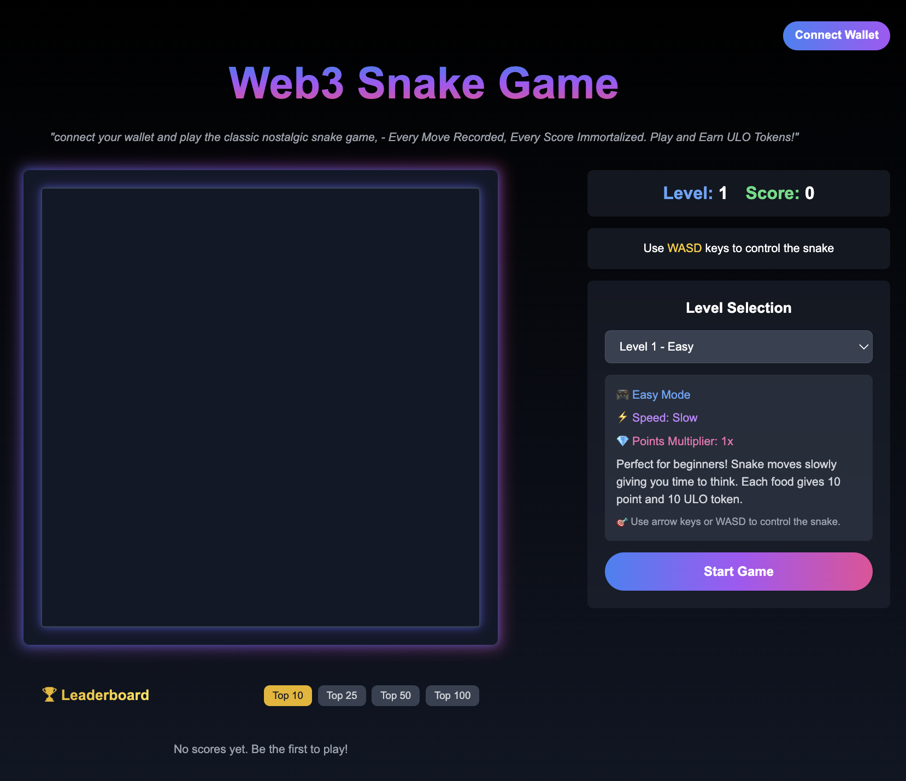

# 🐍 Web3 Snake Game


<div align="center">
  <h3>A Classic Snake Game Reimagined with Web3</h3>
  <p>"Connect your wallet and play the classic nostalgic snake game - Every Move Recorded, Every Score Immortalized"</p>
</div>

---

## 🎮 Features

- **Classic Snake Gameplay**: Experience the nostalgic snake game with modern graphics.
- **Web3 Integration**: Connect your wallet to play and record scores on the blockchain.
- **Smart Contract**: Secure and transparent score tracking using Solidity smart contracts.
- **Leaderboard**: Global leaderboard showing top scores from all players.
- **Level System**: Progressive difficulty with increasing speed.
- **Token Rewards**: Earn ULO tokens for achieving high scores.

---

## 🛠 Tech Stack

### Frontend
- **Framework**: Next.js with TypeScript.
- **Web3 Integration**: wagmi for wallet connections.
### Smart Contract
- **Development**: Solidity with Hardhat environment.
- **Standards**: OpenZeppelin for secure smart contract practices.
- **Features**: ERC20 for Token implementation.
---

## 🚀 Getting Started

### Prerequisites
Before starting, ensure you have the following installed:
- Node.js (LTS version recommended)
- npm or yarn
- MetaMask or any Web3 wallet extension

### Installation

1. Clone the repository:
   ```bash
   git clone https://github.com/emhaihsan/snake-web3.git
   cd snake-web3
   ```

2. Install frontend dependencies:
   ```bash
   cd frontend
   npm install
   ```

3. Install contract dependencies:
   ```bash
   cd ../contracts
   npm install
   ```

4. Start the development server:
   ```bash
   # In the frontend directory
   cd ../frontend
   npm run dev
   ```

---

## 🎯 How to Play

1. Connect your Web3 wallet.
2. Click "Start Game" to begin.
3. Use **W, A, S, D** keys to control the snake.
4. Collect food to grow and increase your score.
5. Avoid collisions with yourself.
6. Submit your score to the blockchain when the game ends.
7. Earn **ULO tokens** based on your performance.

---

## 🔗 Smart Contract

The game utilizes a smart contract deployed on the blockchain for:

- **Score Verification and Storage**: Ensures all scores are valid and stored securely.
- **Token Rewards Distribution**: Awards ULO tokens to players.
- **Leaderboard Management**: Tracks and displays top scores globally.
---


## 📝 License

This project is licensed under the **MIT License**. 
